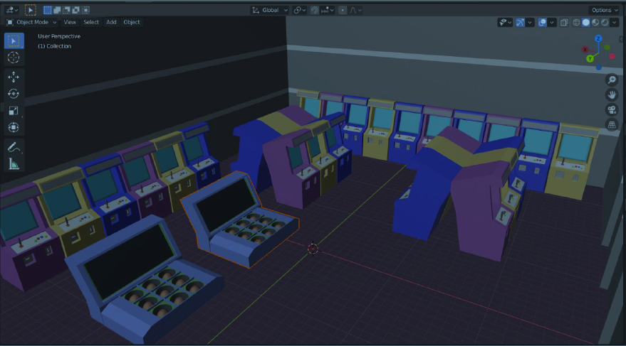
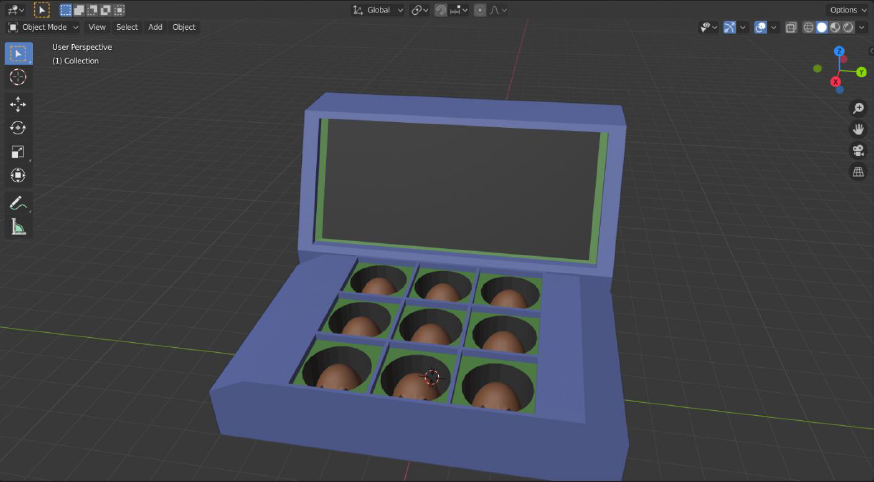

# Whack-A-Mole-VR-Game
Whack-A-Mole VR Game using Unity Engine

I used the button on the VR cardboard (it simulates a touch on the screen) to hit the mole. The game is designed for google cardboard using Unity. I used the hand models and gave the hammer as a child to them. To select the mole being hit, I used the gyroscope of the mobile device, using which we can look around in the virtual world, and to hit a particular mole, I just have to look at that mole, by keeping it at the centre of our view, and hitting the button on the VR cardboard. The moles are generated randomly. The assets are designed using 3D modelling in blender. The next task is to draw back the moles after they have been hit. For that we used the response data from the touch buttons and designed the logic in C# using unity.
Playing the game is easy and fun. You see the moles popping up and down and you just smack them with the hammer in your hand. The score is maintained by our unity scripts at backend.

Snapshots of Environment Setup

